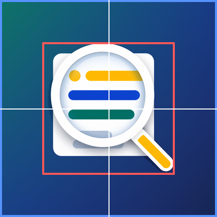

# Android Icon Compliance Resizer

[English README](README.md)

Android Icon Compliance Resizer は、既存のアイコン素材を Android ランチャーアイコン用リソースと Google Play Store 掲載用アイコンに整えるための Codex Skill / Python ツールキットです。

新しいアイコンデザインを作るツールではありません。渡された素材をできるだけ保ったまま、リサイズ、中央寄せ、余白調整、Adaptive Icon XML 生成、プレビュー生成、見切れリスク検証を行います。

## できること

- `512x512` の Google Play Store 用 PNG を生成します。
- Android Adaptive Icon の foreground / background レイヤーを生成します。
- `mipmap-anydpi-v26` 用の Adaptive Icon XML を生成します。
- 必要に応じて従来の density 別 PNG を生成します。
- round icon XML とプレビューを生成できます。
- 透明ピクセルを除いた前景 bounds を検出し、重要なピクセルを Android Adaptive Icon の安全領域内に収めます。
- circle、rounded-square、squircle、square、安全領域オーバーレイのプレビューを生成します。
- Play アイコン形式、Adaptive Icon XML、参照 drawable、legacy サイズ、manifest 参照、見切れリスクを検証します。

## 含まれるファイル

```text
android-icon-compliance-resizer/
├── SKILL.md
├── requirements.txt
├── scripts/
│   ├── pack_android_icons.py
│   ├── validate_android_icons.py
│   └── generate_icon_previews.py
├── references/
│   └── android_icon_requirements.md
└── examples/
    └── README.md
```

## 必要なもの

- Python 3.9 以上
- Pillow

依存関係のインストール:

```bash
python -m pip install -r requirements.txt
```

## 初心者向け: 実際の画像を見ながら試す

この例では、このリポジトリに入っている Mieru アプリのアイコン素材を使います。入力画像、生成される Google Play 用アイコン、Android ランチャーでの見え方を順番に確認できます。

### 1. まずは1枚のアイコン画像から始める

元になるアイコン素材です:


手元に PNG が1枚だけある場合は `--source` を使います。Google Play 用アイコンと、Android ランチャー用の保守的な候補を作れます。

```bash
python scripts/pack_android_icons.py \
  --project-root /path/to/android-project \
  --source docs/images/mieru-source.png \
  --name ic_launcher \
  --legacy \
  --adaptive \
  --round \
  --preview \
  --dry-run
```

`--dry-run` は「実際には書き込まず、何が作られるかだけ確認する」という意味です。初心者はまずこれを実行してください。

### 2. 可能なら foreground と background を分ける

Android Adaptive Icon は、前景と背景が分かれているほうがきれいに作れます。

| Foreground | Background |
| --- | --- |
|  |  |

実際にアイコンリソースを生成するコマンドです:

```bash
python scripts/pack_android_icons.py \
  --project-root /path/to/android-project \
  --foreground docs/images/mieru-foreground.png \
  --background docs/images/mieru-background.png \
  --name ic_launcher \
  --legacy \
  --adaptive \
  --round \
  --preview \
  --backup
```

`--backup` は、既存のアイコンファイルを置き換える前にバックアップを残す指定です。

### 3. 作られたアイコンを見る

Google Play Store 用アイコンは `512x512` の正方形 PNG です:


Android のホーム画面では、端末やランチャーによってアイコンが丸、角丸、squircle などに切り抜かれます。下のプレビューで見切れないか確認します。

| Circle | Rounded square | Squircle | Safe zone |
| --- | --- | --- | --- |
|  |  |  |  |

重要なロゴや文字が赤い安全領域ガイドに近すぎる、または circle preview で消えている場合は、元画像の余白を増やすか、foreground 画像を調整してください。

### 4. リリース前に検証する

アイコン生成後は、次のコマンドで検証します:

```bash
python scripts/validate_android_icons.py \
  --project-root /path/to/android-project \
  --name ic_launcher \
  --strict
```

警告が出た場合は、Google Play にアップロードしたりアプリを公開したりする前に内容を確認してください。

## クイックスタート

まず dry-run で変更予定を確認します:

```bash
python scripts/pack_android_icons.py \
  --project-root /path/to/android-project \
  --source /path/to/icon.png \
  --name ic_launcher \
  --legacy \
  --adaptive \
  --round \
  --preview \
  --dry-run
```

バックアップ付きで生成します:

```bash
python scripts/pack_android_icons.py \
  --project-root /path/to/android-project \
  --source /path/to/icon.png \
  --name ic_launcher \
  --legacy \
  --adaptive \
  --round \
  --preview \
  --backup
```

生成済みリソースを検証します:

```bash
python scripts/validate_android_icons.py \
  --project-root /path/to/android-project \
  --name ic_launcher \
  --strict
```

## より良い Adaptive Icon を作るには

可能なら foreground / background / monochrome を分けて渡します:

```bash
python scripts/pack_android_icons.py \
  --project-root /path/to/android-project \
  --foreground /path/to/foreground.png \
  --background "#0F172A" \
  --monochrome /path/to/monochrome.png \
  --name ic_launcher \
  --adaptive \
  --round \
  --preview \
  --backup
```

単一の平坦な PNG からも生成できますが、ロゴと背景を完全には分離できません。その場合、Adaptive Icon の出力は保守的な候補として扱い、リリース前に生成プレビューを必ず目視確認してください。

## GitHub 用説明文

短い説明:

```text
Android ランチャーアイコンと Google Play Store アイコンをリサイズ、生成、プレビュー、検証する Codex Skill / Python ツールキット。
```

英語の短い説明:

```text
Codex Skill and Python toolkit for resizing, packing, previewing, and validating Android launcher icons and Google Play Store icons.
```

おすすめ topics:

```text
android, adaptive-icons, launcher-icon, google-play, python, pillow, codex-skill
```

## 注意

- Google Play Store 用アイコンと Android ランチャーアイコンは別物です。
- Google Play 用アイコンに角丸、外枠、ドロップシャドウを焼き込まないでください。
- Android Adaptive Icon の foreground の重要部分は中央の安全領域内に収める必要があります。
- 実際のリリース前に、生成されたプレビューを必ず目視確認してください。
- アプリプロジェクトへ書き込む前に、まず `--dry-run` を使ってください。
